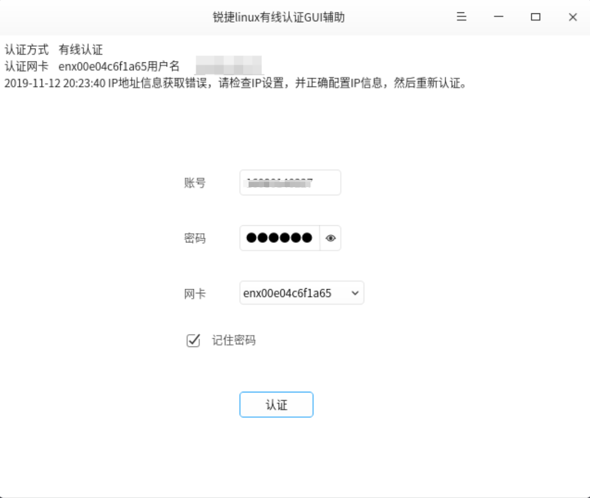

# 锐捷有线认证，Linux图形界面客户端

> 使用qt平台，部分采用Dtk框架，构建图形界面。
> 通过QProcess直接调用原生程序。
> 未对锐捷源生linux客户端程序进行任何实质性修改。


## 展示



## 开发计划 

- [x] 登录界面
- [x] dock支持
- [x] 认证主逻辑
- [x] 状态信息显示
- [x] 信息记忆
- [x] 拦截重复启动
- [x] 认证成功信息界面
- [ ] 软件启动自动登陆选项

# 依赖环境

* g++
* gdb
* qt
* dtk

```bash

sudo apt install -y libdtkwidget-dev g++ gdb make qtchooser qt5-qmake qt5-default gdb

```


## 编译

```bash
sudo apt-get install git
git clone https://github.com/sunowsir/rj-aux.git
cd rj-aux/
mkdir build
cd build/
qmake ..
make 
```

*  手动用开发环境构建后无法直接使用，需要将构建生成的可执行程序、`script/`下的脚本以及policy文件一同放到锐捷源生程序目录下。
*  打包的deb安装包中集成了锐捷源程序，安装后可以直接使用。
*  增加了锐捷原生程序目录中缺少的必要的动态链接库。

## 下载

详情见: [releases](https://github.com/sunowsir/rj-aux/releases)

## 声明

* 本软件采用GPLv3协议开源，不包括锐捷源生程序，并且本仓库中也不包含锐捷源生程序，
